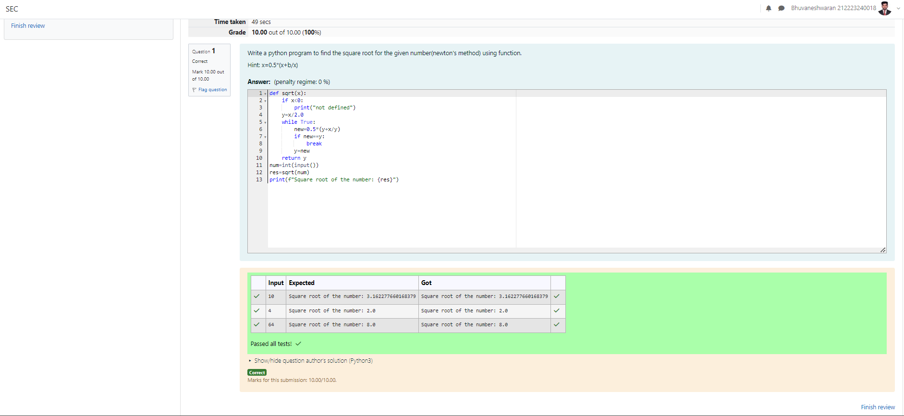

# Find the square root of a number

## AIM:
To write a program to find the square root of a number.

## Equipments Required:
1. Hardware – PCs
2. Anaconda – Python 3.7 Installation / Moodle-Code Runner

## Algorithm
1. Define a function.
2. Assign number_iters = 100 in the function to perform 100 iteratios.
3. Set i = 0.
4. Calculate  number = 0.5 * (number + a / number) for 100 iterations.
5. Return number

## Program:

Program to find the square root for the given number(newton's method) using function.

Developed by:Bhuvaneshwaran H 

RegisterNumber:212223240018  
```
def sqrt(x):
    if x<0:
        print("not defined")
    y=x/2.0
    while True:
        new=0.5*(y+x/y)
        if new==y:
            break
        y=new
    return y
num=int(input())
res=sqrt(num)
print(f"Square root of the number: {res}")
```


## Output:


## Result:
Thus the program to find the square root for the given number(newton's method) using function is written and verified using python programming.
